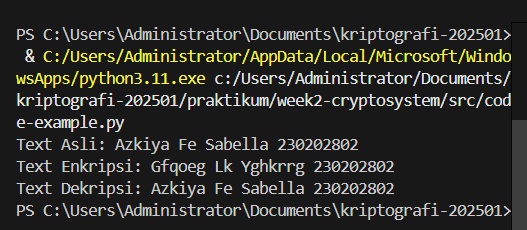
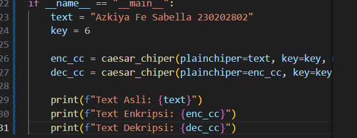

# Laporan Praktikum Kriptografi
Minggu ke-: 2  
Topik: Implementasi Algoritma Caesar Chiper dan Kriptosistem
Nama: Azkiya Fe Sabella
NIM: 230202802  
Kelas: 5 IKKA 

---

## 1. Tujuan
1. Mengidentifikasi komponen dasar kriptosistem (plaintext, ciphertext, kunci, algoritma).
2. Menggambarkan proses enkripsi dan dekripsi sederhana.
3. Mengklasifikasikan jenis kriptosistem (simetris dan asimetris).

## 2. Dasar Teori
Kriptosistem adalah sebuah sistem yang terdiri dari serangkaian komponen dan prosedur untuk mengamankan data melalui enkripsi dan dekripsi. Komponen utamanya meliputi plaintext (pesan asli), ciphertext (pesan terenkripsi), kunci (informasi rahasia untuk transformasi), dan algoritma (metode matematis untuk enkripsi/dekripsi).

Salah satu contoh algoritma kriptografi klasik adalah Caesar Cipher. Algoritma ini termasuk dalam kategori substitution cipher, di mana setiap huruf dalam plaintext digantikan oleh huruf lain yang memiliki posisi tetap dalam alfabet. Jarak pergeseran huruf ditentukan oleh sebuah kunci numerik. Proses dekripsi dilakukan dengan menggeser huruf ke arah sebaliknya menggunakan kunci yang sama.

## 3. Alat dan Bahan
(- Python 3.x  
- Visual Studio Code / editor lain  
- Git dan akun GitHub  
- Library tambahan (misalnya pycryptodome, jika diperlukan)  )

---

## 4. Langkah Percobaan
(Tuliskan langkah yang dilakukan sesuai instruksi.  
Contoh format:
1. Membuat file `caesar_cipher.py` di folder `praktikum/week2-cryptosystem/src/`.
2. Menyalin kode program dari panduan praktikum.
3. Menjalankan program dengan perintah `python caesar_cipher.py`.)

---

## 5. Source Code
(Salin kode program utama yang dibuat atau dimodifikasi)  
Gunakan blok kode:

def caesar_chiper(plainchiper: str, key: int, mode: str) -> str:
    """
    parameter:
        plainchiper: input plaintext or chipertext
        key: pergeseran yang diingikan
        mode: "enc" enkripsi, "dec" dekripssi
    """
    if mode not in ("enc", "dec"):
        raise ValueError("Mode harus 'enc' atau 'dec'")

    result = ""
    key = key if mode == "enc" else (-key if mode == "dec" else key)
    for char in plainchiper:
        if char.isalpha():
            shift = 65 if char.isupper() else 97
            result += chr((ord(char) - shift + key) % 26 + shift)
        else:
            result += char
    return result


if __name__ == "__main__":
    text = "Azkiya Fe Sabella 230202802"
    key = 6

    enc_cc = caesar_chiper(plainchiper=text, key=key, mode="enc")
    dec_cc = caesar_chiper(plainchiper=enc_cc, key=key, mode="dec")

    print(f"Text Asli: {text}")
    print(f"Text Enkripsi: {enc_cc}")
    print(f"Text Dekripsi: {dec_cc}")

## 6. Hasil dan Pembahasan
Hasil ini sesuai dengan ekspektasi. Program berhasil mengubah plaintext menjadi ciphertext yang tidak dapat dibaca, dan kemudian mengembalikannya ke bentuk semula dengan proses dekripsi. Karakter angka dan spasi tidak berubah karena logika program hanya memproses karakter alfabet. 

Hasil eksekusi program Caesar Cipher:



## 7. Jawaban Pertanyaan
1. Sebutkan komponen utama dalam sebuah kriptosistem.

Plaintext: Pesan asli yang dapat dibaca.
Ciphertext: Pesan terenkripsi hasil dari proses enkripsi.
Kunci (Key): Informasi rahasia yang digunakan untuk mengontrol algoritma enkripsi dan dekripsi.
Algoritma (Cipher): Aturan atau fungsi matematis yang digunakan untuk transformasi data.
Enkripsi & Dekripsi: Proses transformasi dari plaintext ke ciphertext dan sebaliknya.
2. Apa kelebihan dan kelemahan sistem simetris dibandingkan asimetris?

Sistem Simetris:
Kelebihan: Proses enkripsi/dekripsi sangat cepat.
Kelemahan: Sulit dalam distribusi kunci yang aman dan manajemen kunci yang rumit untuk skala besar.
Sistem Asimetris:
Kelebihan: Memecahkan masalah distribusi kunci dan menyediakan otentikasi yang lebih baik.
Kelemahan: Proses komputasi jauh lebih lambat dan memakan lebih banyak sumber daya.
3. Mengapa distribusi kunci menjadi masalah utama dalam kriptografi simetris? Karena kunci yang sama digunakan untuk enkripsi dan dekripsi, kunci tersebut harus dikirim dari pengirim ke penerima melalui sebuah kanal yang aman. Jika kanal tersebut tidak aman dan kunci berhasil disadap oleh pihak ketiga, maka seluruh kerahasiaan pesan akan hilang karena pihak ketiga tersebut dapat mendekripsi semua pesan yang dikirim.

## 8. Kesimpulan
Praktikum ini berhasil mengimplementasikan algoritma Caesar Cipher sebagai contoh kriptosistem simetris sederhana. Dari percobaan, dapat disimpulkan bahwa sebuah kriptosistem terdiri dari komponen-komponen kunci seperti plaintext, ciphertext, algoritma, dan kunci. Selain itu, dipahami pula perbedaan mendasar antara kriptografi simetris yang cepat namun memiliki tantangan distribusi kunci, dengan kriptografi asimetris yang lebih lambat namun lebih aman dalam hal manajemen kunci.

## 9. Daftar Pustaka
(Cantumkan referensi yang digunakan.  
Contoh:  
- Katz, J., & Lindell, Y. *Introduction to Modern Cryptography*.  
- Stallings, W. *Cryptography and Network Security*.  )

---

## 10. Commit Log
(Tuliskan bukti commit Git yang relevan.  
Contoh:
```
commit abc12345
Author: Azkiya Fe Sabella <azkiyafesabella14@gmail.com>
Date:   2025-09-20

    week2-cryptosystem: implementasi Caesar Cipher dan laporan )
```
