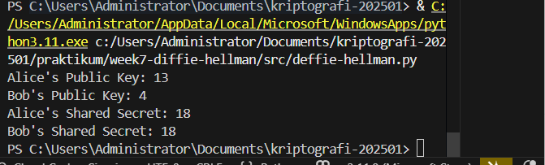

# Laporan Praktikum Kriptografi
Minggu ke-: 7  
Topik: Delfie-Hellman 
Nama: Azkiya Fe Sabella 
NIM: 230202802  
Kelas: 5 IKKA  

## 1. Tujuan
Setelah mengikuti praktikum ini, mahasiswa diharapkan mampu:
1. Melakukan simulasi protokol Diffie-Hellman untuk pertukaran kunci publik.
2. Menjelaskan mekanisme pertukaran kunci rahasia menggunakan bilangan prima dan logaritma diskrit.
3. Menganalisis potensi serangan pada protokol - Diffie-Hellman (termasuk serangan Man-in-the-Middle / MITM).

## 2. Dasar Teori
1. Konsep Dasar
Diffie-Hellman Key Exchange adalah protokol kriptografi yang memungkinkan dua pihak untuk membuat kunci rahasia bersama melalui saluran komunikasi publik yang tidak aman. Protokol ini ditemukan oleh Whitfield Diffie dan Martin Hellman pada tahun 1976 dan menjadi dasar bagi banyak protokol keamanan modern seperti TLS/SSL.

2. Mekanisme Matematis
Protokol ini bekerja berdasarkan kesulitan matematis dalam memecahkan masalah logaritma diskrit. Langkah-langkahnya sebagai berikut:

Parameter Publik: Alice dan Bob menyepakati bilangan prima besar 
p dan generator g secara publik.

Pembangkitan Kunci Privat:
Alice memilih kunci privat acak a dimana 1 < a < p
Bob memilih kunci privat acak b dimana 1 < b < p
Perhitungan Kunci Publik:
Alice menghitung: A =ga mod p
Bob menghitung: B=gb mod p
Pertukaran Kunci Publik: Alice mengirim A ke Bob, dan Bob mengirim B ke Alice melalui saluran publik.
Perhitungan Shared Secret:
Alice menghitung: sA=Ba mod p =(gb)a mod p=gab mod p
Bob menghitung: sB=Ab mod p =(ga)b mod p=gab mod p
Verifikasi: Kedua pihak memiliki shared secret yang sama: sA=sB=gab mod p
3. Keamanan
Keamanan protokol bergantung pada Discrete Logarithm Problem (DLP): Diberikan g, p, dan A=ga mod p, sangat sulit secara komputasional untuk menemukan nilai a.

Meskipun Diffie-Hellman aman terhadap penyadapan pasif, protokol ini rentan terhadap serangan Man-in-the-Middle (MITM) jika tidak dikombinasikan dengan mekanisme autentikasi. Dalam serangan MITM, penyerang dapat mencegat dan memodifikasi kunci publik yang dipertukarkan, sehingga dapat mendekripsi komunikasi.

## 3. Alat dan Bahan
(- Python 3.x  
- Visual Studio Code / editor lain  
- Git dan akun GitHub  
- Library tambahan (misalnya pycryptodome, jika diperlukan)  )


## 4. Langkah Percobaan
Membuat folder struktur praktikum/week7-diffie-hellman/src/ dan screenshots/.
Mengimplementasikan class DiffieHellman dalam file src/deffie-hellman.py.
Membuat implementasi dengan parameter publik (p=23, g=5).
Menggunakan private key yang sudah ditentukan untuk Alice (a=92378234) dan Bob (b=23482342).
Menjalankan simulasi pertukaran kunci dan menghitung shared secret.
Memverifikasi bahwa shared secret Alice dan Bob sama.
Menjalankan program dengan perintah python deffie-hellman.py.
Mengambil screenshot hasil eksekusi program.

## 5. Source Code
import random

class DiffieHellman:
    def __init__(
        self,
        p: int,
        g: int,
        name: str,
        private_key: int = None,
    ):
        self.p = p
        self.g = g
        self.name = name
        self.private_key = random.randint(1, p - 1) if private_key is None else private_key
        self.public_key = pow(g, self.private_key, p)
        self.shared_secret = None

    def compute_shared_secret(self, other_public_key: int):
        self.shared_secret = pow(other_public_key, self.private_key, self.p)
        return self.shared_secret


if __name__ == "__main__":
    p = 23  
    g = 5  

    A = 92378234
    B = 23482342

    # Alice's side
    alice = DiffieHellman(p, g, "Alice", private_key=A)
    print(f"Alice's Public Key: {alice.public_key}")

    # Bob's side
    bob = DiffieHellman(p, g, "Bob", private_key=B)
    print(f"Bob's Public Key: {bob.public_key}")

    # Compute shared secrets
    alice_shared_secret = alice.compute_shared_secret(bob.public_key)
    bob_shared_secret = bob.compute_shared_secret(alice.public_key)

    print(f"Alice's Shared Secret: {alice_shared_secret}")
    print(f"Bob's Shared Secret: {bob_shared_secret}")
    assert alice_shared_secret == bob_shared_secret, "Shared secrets do not match!"

## 6. Hasil dan Pembahasan
Program berhasil memverifikasi bahwa kedua shared secret identik (sA=sB=18), yang membuktikan protokol Diffie-Hellman berfungsi dengan benar. Assertion tidak menghasilkan error, menandakan kunci bersama berhasil dibuat tanpa pernah mengirimkan private key melalui jaringan. Output:
Hasil eksekusi program Caesar Cipher:



## 7. Jawaban Pertanyaan
Pertanyaan 1: Mengapa Diffie-Hellman memungkinkan pertukaran kunci di saluran publik?
Diffie-Hellman memungkinkan pertukaran kunci di saluran publik karena menggunakan konsep matematika one-way function berbasis masalah logaritma diskrit.
Meskipun public key (A dan B) dikirim melalui saluran terbuka, sangat sulit secara komputasional untuk menghitung private key dari public key yang diketahui:
- Mudah menghitung: A=ga mod p (forward direction)
- Sangat sulit menghitung: a dari A,g,p (backward direction - Discrete Log Problem)
Prosesnya:
1. Alice mengirim A = ga mod p
2. Bob mengirim B = gb mod p
3. Penyerang mengetahui g,p,A,B tetapi tidak dapat menghitung a atau b
4. Alice menghitung: s = Ba mod p =(gb)a mod p = gab mod p
5. Bob menghitung: s = Ab mod p =(ga)b mod p = gab mod p
Kedua pihak mendapatkan shared secret yang sama: s = gab mod p

Pertanyaan 2: Apa kelemahan utama protokol Diffie-Hellman murni?
Kelemahan utama protokol Diffie-Hellman murni adalah:
Rentan terhadap Man-in-the-Middle (MITM): Tidak ada mekanisme autentikasi bawaan untuk memverifikasi identitas pihak yang berkomunikasi. Penyerang dapat mencegat dan memodifikasi public key.
Tidak memberikan autentikasi: Protokol hanya menjamin kerahasiaan (confidentiality), bukan autentikasi atau integritas pesan. Alice tidak dapat memverifikasi bahwa dia berkomunikasi dengan Bob yang sebenarnya.
Bergantung pada parameter yang kuat: Keamanan sangat bergantung pada pemilihan:
Bilangan prima 
p yang cukup besar (minimal 2048 bit) Generator yang tepat
Private key yang benar-benar acak
Computational cost: Operasi modular exponentiation dengan bilangan besar memerlukan komputasi yang intensif.
Tidak ada forward secrecy sempurna: Jika private key terkompromikan, penyerang yang merekam komunikasi masa lalu dapat mendekripsinya.

Pertanyaan 3: Bagaimana cara mencegah serangan MITM pada protokol ini?
Beberapa cara untuk mencegah serangan MITM pada protokol Diffie-Hellman:
1. Digital Signatures:
Menandatangani public key dengan private key dari sistem kriptografi asimetris (RSA/ECDSA)
Alice mengirim: 
(A,SignSKA(A))
Bob memverifikasi dengan public key Alice: 
VerifyPKA(A,signature)
2. Sertifikat Digital (PKI):
Menggunakan Public Key Infrastructure
Certificate Authority (CA) terpercaya menandatangani sertifikat
Sertifikat mengikat identitas dengan public key
3. Pre-shared Keys (PSK):
Menggunakan kunci rahasia yang dibagikan sebelumnya melalui saluran aman
Menggunakan HMAC untuk autentikasi: 
HMACPSK(A)
4. Station-to-Station (STS) Protocol:
Variasi Diffie-Hellman dengan autentikasi
Menambahkan digital signature dan enkripsi pada pertukaran kunci
Formula: 
Es(SignSK(gx,gy))
5. Perfect Forward Secrecy (PFS):
Menggunakan Ephemeral Diffie-Hellman (DHE/ECDHE)
Menghasilkan pasangan kunci baru untuk setiap sesi
Kompromisasi satu kunci tidak mempengaruhi sesi lainnya
6. Authenticated Diffie-Hellman:
Mengkombinasikan dengan protokol autentikasi seperti HMAC
Formula verifikasi: 
HMACk(A||B)=HMACk(gamodp||gbmodp)

## 8. Kesimpulan
Praktikum ini berhasil mengimplementasikan dan mensimulasikan protokol Diffie-Hellman Key Exchange menggunakan Python. Protokol memungkinkan Alice dan Bob untuk membuat kunci rahasia bersama (s=18) melalui saluran publik tanpa mengirimkan kunci privat.

## 9. Daftar Pustaka
(Cantumkan referensi yang digunakan.  
Contoh:  
- Katz, J., & Lindell, Y. *Introduction to Modern Cryptography*.  
- Stallings, W. *Cryptography and Network Security*.  )

---

## 10. Commit Log
(Tuliskan bukti commit Git yang relevan.  
Contoh:
```
commit abc12345
Author: Azkiya Fe Sabella <az>
Date:   2025-09-20

   week7-diffie-hellman: implementasi Diffie-Hellman Key Exchange)
```
